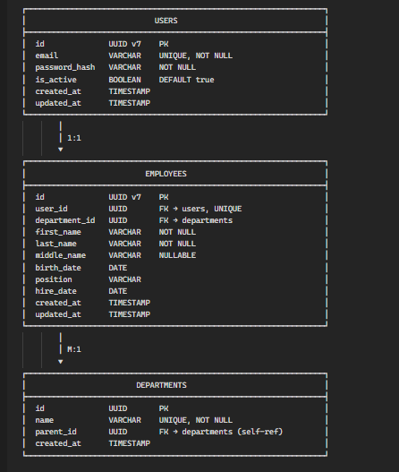
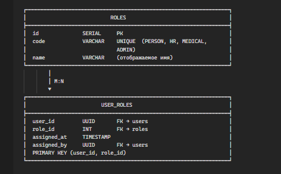
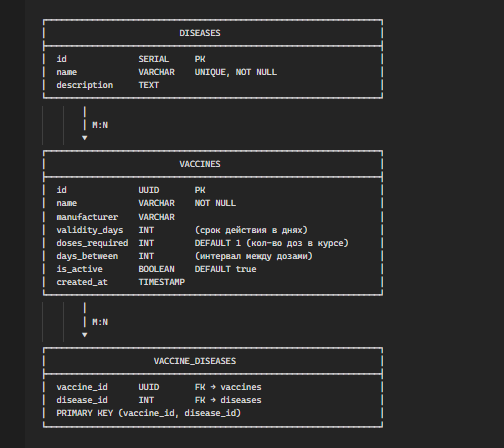
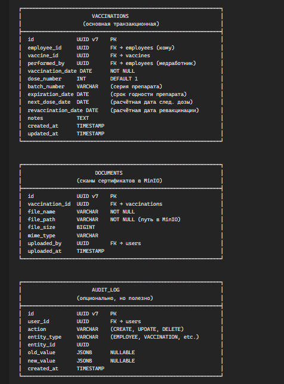
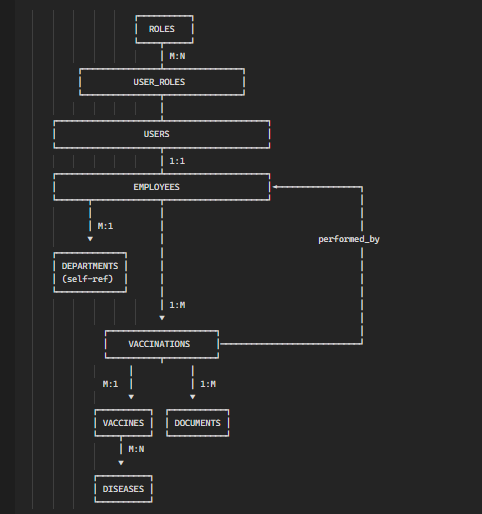

### Стек

#### Backend:
- язык: kotlin
- jdk 21
- framework: spring boot 4.0.3
- база данных: postgresql (основная), h2 (для тестов)
- миграция: flyway
- хранилище: minio

#### Frontend:
- язык: typeScript
- framework: react

### Сущности и поля

### Связи между сущностями (ER)

### Где какой PK используется 

**UUID v7**

- Users
- Employees
- Vaccinations
- Documents
- Audit_Log

**UUID v4**

- Departments
- Vaccines

**SERIAL**

- Roles
- Diseases
- User_Roles (составной PK из FK)
- Vaccine_Diseases (составной PK из FK)

### Подробнее про сущности 

#### Users

**Зачем:** Аутентификация и авторизация. Это «учётная запись» для входа в систему, отделённая от данных о человеке.

| Поле          | Тип       | Зачем                                                                                                  |
| ------------- | --------- | ------------------------------------------------------------------------------------------------------ |
| id            | UUID v7   | Уникальный идентификатор. v7, потому что пользователей может быть много и важна хронология регистрации |
| email         | VARCHAR   | Логин для входа. Email удобен — уникален, легко запомнить, можно слать уведомления                     |
| password_hash | VARCHAR   | Хэш пароля (никогда не храним пароль в открытом виде). BCrypt или Argon2                               |
| is_active     | BOOLEAN   | Мягкое удаление. Уволился сотрудник — ставим false, а не удаляем. История сохраняется                  |
| created_at    | TIMESTAMP | Когда создан аккаунт. Для аудита и отчётов                                                             |
| updated_at    | TIMESTAMP | Когда последний раз менялись данные. Для отладки и синхронизации                                       |

**Почему отдельно от Employee:** Разделение ответственности. User — это «как войти», Employee — это «кто ты в компании». Можно иметь сотрудника без учётки (уволенный, но история прививок нужна) или учётку без сотрудника (внешний аудитор).

---

#### Employees

**Зачем:** Кадровая информация о человеке. Кому делают прививки.

| Поле          | Тип       | Зачем                                                                             |
| ------------- | --------- | --------------------------------------------------------------------------------- |
| id            | UUID v7   | Много сотрудников, часто создаются                                                |
| user_id       | UUID FK   | Связь с учёткой. UNIQUE — один человек = одна учётка. NULLABLE — можно без учётки |
| department_id | UUID FK   | В каком подразделении работает. Для отчётов «охват по отделам»                    |
| first_name    | VARCHAR   | ФИО — базовые                                                                     |
| last_name     | VARCHAR   | идентификационные                                                                 |
| middle_name   | VARCHAR   | данные. Отчество nullable, не у всех есть                                         |
| birth_date    | DATE      | Возраст важен для некоторых вакцин (противопоказания, дозировки)                  |
| position      | VARCHAR   | Должность. Некоторые вакцины обязательны для определённых должностей              |
| hire_date     | DATE      | Дата приёма. Для отчётов «новые сотрудники без прививок»                          |
| created_at    | TIMESTAMP | Аудит                                                                             |
| updated_at    | TIMESTAMP | Аудит                                                                             |

---

#### Departments

**Зачем:** Организационная структура предприятия. Нужна для группировки сотрудников и отчётов.

| Поле       | Тип       | Зачем                                                                                                  |
| ---------- | --------- | ------------------------------------------------------------------------------------------------------ |
| id         | UUID v4   | Справочник среднего размера, не нужна сортировка по времени                                            |
| name       | VARCHAR   | Название: «Бухгалтерия», «Цех №1»                                                                      |
| parent_id  | UUID FK   | Ссылка на родительский отдел. Даёт иерархию: Завод → Цех → Участок. Для отчётов «по всему направлению» |
| created_at | TIMESTAMP | Когда создано                                                                                          |

**Почему иерархия:** HR может отвечать за целое управление. С parent_id можно одним запросом получить всех сотрудников «управления и всех вложенных отделов».

---

#### Roles

**Зачем:** Справочник ролей для разграничения прав.

| Поле | Тип     | Зачем                                                                      |
| ---- | ------- | -------------------------------------------------------------------------- |
| id   | SERIAL  | Ролей мало (4 штуки), простой числовой ID                                  |
| code | VARCHAR | Машинное имя: PERSON, HR, MEDICAL, ADMIN. Используется в коде для проверок |
| name | VARCHAR | Человекочитаемое: «Сотрудник», «Медработник». Для UI                       |

**Почему так просто:** Роли почти никогда не меняются. Можно даже enum в коде, но таблица даёт гибкость добавить роль без деплоя.

---

#### User_Roles

**Зачем:** Связь «многие ко многим» между пользователями и ролями. Один человек может иметь несколько ролей (админ + сотрудник).

|Поле|Тип|Зачем|
|---|---|---|
|user_id|UUID FK|Кому назначена роль|
|role_id|INT FK|Какая роль|
|assigned_at|TIMESTAMP|Когда назначена. Для аудита: «кто и когда дал права»|
|assigned_by|UUID FK|Кто назначил. Для аудита и безопасности|

**Почему M:N:** Админ должен видеть и свои прививки (роль PERSON) и управлять системой (роль ADMIN). Без M:N пришлось бы дублировать пользователей.

---

#### Diseases

**Зачем:** Справочник заболеваний, от которых защищают вакцины.

| Поле        | Тип     | Зачем                                                                       |
| ----------- | ------- | --------------------------------------------------------------------------- |
| id          | SERIAL  | Маленький справочник (грипп, корь, гепатит...), 10–30 записей               |
| name        | VARCHAR | Название болезни                                                            |
| description | TEXT    | Описание, симптомы, почему важна вакцинация. Для информирования сотрудников |

**Зачем отдельно от Vaccines:** Одна вакцина может защищать от нескольких болезней (АКДС — коклюш, дифтерия, столбняк). И наоборот, от одной болезни могут быть разные вакцины.

---

#### Vaccines

**Зачем:** Справочник вакцин — что вообще можно вколоть.

| Поле           | Тип       | Зачем                                                                          |
| -------------- | --------- | ------------------------------------------------------------------------------ |
| id             | UUID v4   | Справочник, но может быть несколько десятков вакцин                            |
| name           | VARCHAR   | Торговое название: «Спутник V», «Гриппол»                                      |
| manufacturer   | VARCHAR   | Производитель. Для отчётности и выбора                                         |
| validity_days  | INT       | Срок действия в днях. Ключевое поле — по нему считается дата ревакцинации      |
| doses_required | INT       | Сколько доз в курсе. 1 для гриппа, 2–3 для COVID                               |
| days_between   | INT       | Интервал между дозами в днях. Для расчёта next_dose_date                       |
| is_active      | BOOLEAN   | Мягкое удаление. Сняли вакцину с производства — ставим false, история остаётся |
| created_at     | TIMESTAMP | Аудит                                                                          |

---

#### Vaccine_Diseases

**Зачем:** Связь «многие ко многим» между вакцинами и болезнями.

|Поле|Тип|Зачем|
|---|---|---|
|vaccine_id|UUID FK|Какая вакцина|
|disease_id|INT FK|От какой болезни защищает|

**Пример:** АКДС будет иметь три записи — связи с коклюшем, дифтерией и столбняком.

---

#### Vaccinations

**Зачем:** Главная транзакционная таблица. Факт: «такому-то сотруднику такого-то числа сделали такую-то прививку».

|Поле|Тип|Зачем|
|---|---|---|
|id|UUID v7|Много записей, важна хронология|
|employee_id|UUID FK|Кому сделали|
|vaccine_id|UUID FK|Какую вакцину|
|performed_by|UUID FK|Кто сделал (медработник). Для ответственности и аудита|
|vaccination_date|DATE|Когда сделали. Ключевая дата для всех расчётов|
|dose_number|INT|Какая доза по счёту (1, 2, 3...). Для многодозовых вакцин|
|batch_number|VARCHAR|Серия препарата. Требование законодательства, нужно для отзыва партий|
|expiration_date|DATE|Срок годности ампулы. Обязательное поле при создании и редактировании записи, нужно для контроля качества|
|next_dose_date|DATE|Расчётное: когда следующая доза (если курс не завершён)|
|revaccination_date|DATE|Расчётное: когда ревакцинация. vaccination_date + validity_days|
|notes|TEXT|Примечания: реакция, особые обстоятельства|
|created_at|TIMESTAMP|Когда внесена запись (может отличаться от даты прививки)|
|updated_at|TIMESTAMP|Когда редактировали|

**Почему next_dose_date и revaccination_date хранятся, а не вычисляются:** Денормализация ради скорости. Запрос «кому пора на прививку» — это просто `WHERE revaccination_date <= NOW() + INTERVAL '30 days'`. Без этих полей пришлось бы JOIN с vaccines и вычислять на лету для тысяч записей.

---

#### Documents

**Зачем:** Метаданные файлов в MinIO. Сканы сертификатов, справок о вакцинации.

|Поле|Тип|Зачем|
|---|---|---|
|id|UUID v7|Документов много, важна хронология загрузки|
|vaccination_id|UUID FK|К какой прививке относится документ|
|file_name|VARCHAR|Оригинальное имя файла. Для отображения пользователю|
|file_path|VARCHAR|Путь в MinIO (bucket/key). Для получения файла|
|file_size|BIGINT|Размер в байтах. Для UI и контроля лимитов|
|mime_type|VARCHAR|Тип файла: image/jpeg, application/pdf. Для корректного отображения|
|uploaded_by|UUID FK|Кто загрузил. Аудит|
|uploaded_at|TIMESTAMP|Когда загрузил|

**Почему не хранить файлы в БД:** BLOB в PostgreSQL — плохая практика для файлов. MinIO масштабируется отдельно, можно настроить CDN, бэкапы файлов отдельно от БД.

---

#### Audit_Log

**Зачем:** Журнал всех изменений. Кто, когда и что поменял. Требование безопасности и возможность «откатить» или расследовать инциденты.

| Поле        | Тип       | Зачем                                    |
| ----------- | --------- | ---------------------------------------- |
| id          | UUID v7   | Много записей, строго хронологически     |
| user_id     | UUID FK   | Кто совершил действие                    |
| action      | VARCHAR   | Что сделал: CREATE, UPDATE, DELETE       |
| entity_type | VARCHAR   | С какой сущностью: EMPLOYEE, VACCINATION |
| entity_id   | UUID      | ID конкретной записи                     |
| old_value   | JSONB     | Что было до изменения. NULL для CREATE   |
| new_value   | JSONB     | Что стало после. NULL для DELETE         |
| created_at  | TIMESTAMP | Когда произошло                          |

**Почему JSONB:** Универсально для любых сущностей. Не нужно создавать отдельные таблицы аудита для каждой сущности.
