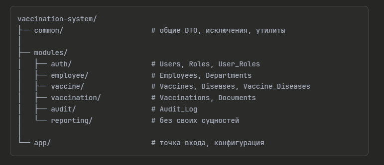
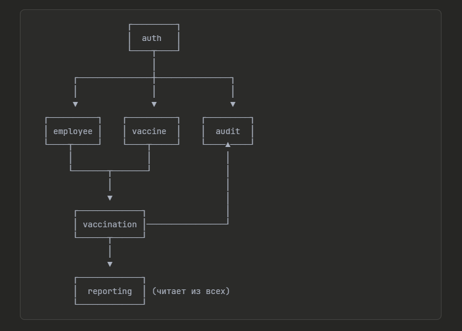

# Модули и их сущности

## auth

**Ответственность:** Аутентификация, авторизация, управление доступом.

**Сущности:**

- Users
- Roles
- User_Roles

**Почему вместе:** Это всё про «кто ты и что тебе можно». Логин, JWT-токены, проверка прав — единая зона ответственности. Остальные модули спрашивают auth: «можно ли этому пользователю делать X?»

---

## employee

**Ответственность:** Кадровый учёт, организационная структура.

**Сущности:**

- Employees
- Departments

**Почему вместе:** Сотрудник принадлежит подразделению — это одна предметная область. HR-функционал: кто где работает, иерархия отделов, поиск сотрудников.

---

## vaccine

**Ответственность:** Справочники медицинских данных.

**Сущности:**

- Vaccines
- Diseases
- Vaccine_Diseases

**Почему вместе:** Это «что можно вколоть и от чего». Чистый справочник, редко меняется, используется другими модулями как источник данных.

---

## vaccination

**Ответственность:** Основная бизнес-логика. Учёт прививок, расчёт сроков.

**Сущности:**

- Vaccinations
- Documents

**Почему вместе:** Документ — это приложение к факту вакцинации, не существует отдельно. Здесь же логика расчёта `next_dose_date` и `revaccination_date`, работа с MinIO.

---

## audit

**Ответственность:** Логирование всех изменений в системе.

**Сущности:**

- Audit_Log

**Почему отдельно:** Аудит — сквозная функциональность. Все модули пишут в лог, но сам лог не зависит от бизнес-логики. Можно подключить через Spring Events или AOP.

---

## reporting

**Ответственность:** Отчёты и статистика.

**Сущности:** Нет своих таблиц.

**Почему отдельно:** Читает данные из других модулей, агрегирует, форматирует. Отчёты: «кому пора на ревакцинацию», «охват по подразделениям», «статистика за период». Экспорт в Excel/PDF.

---

## Итоговая схема

---

## Зависимости между модулями

